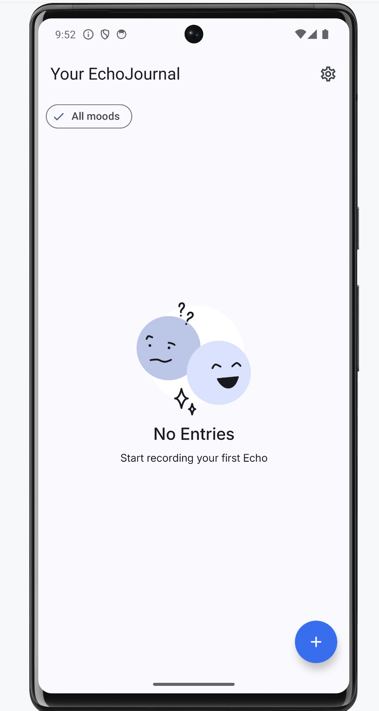
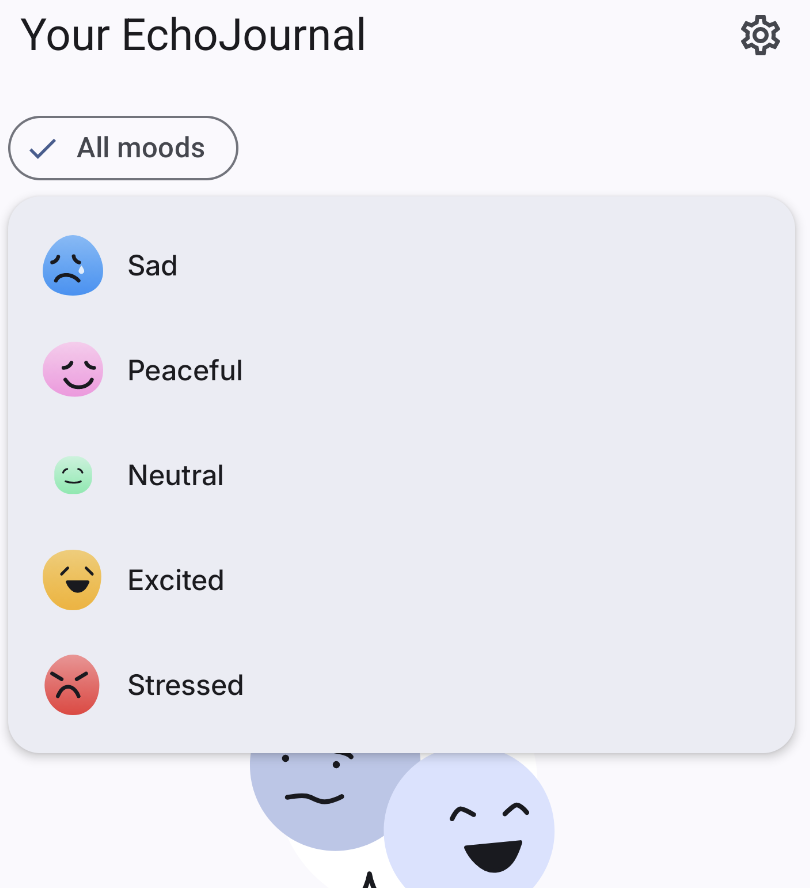
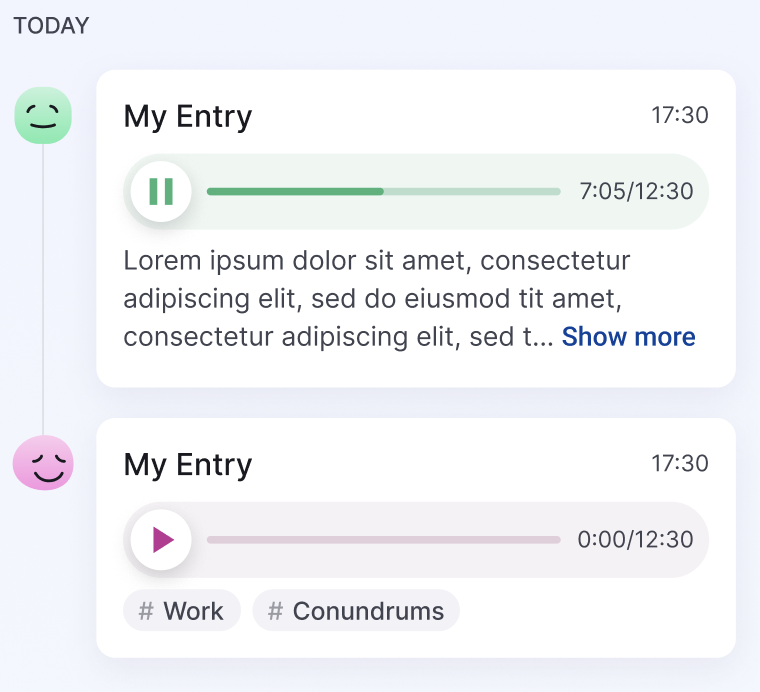

# EchoJournal

**Status:** In development 🚧

EchoJournal is a vibrant audio journaling app designed to help users quickly log their thoughts and moods throughout the day by recording voice memos.

## Features ✨

- **Quick voice recording**: Save your thoughts in seconds without the need to type.
- **Colorful and intuitive interface**: A user-friendly design that makes journaling easy and enjoyable.
- **Mood tracking**: Add tags or colors to your recordings.
- **Filter by topics and mood**: Easily find past entries based on mood or specific topics.
- **Create custom topics**: Organize your journal entries by defining your own topics.
- **Add descriptions to entries**: Enhance your voice memos with additional context and details.
- **Easy access and playback**: Listen to your entries anytime to reflect on your day or recall important ideas.

## Project Status 🚀

EchoJournal is currently in development. As a solo developer, I am working hard to improve the experience and add more useful features. Your feedback is welcome!

## Sneak peek (Screen Shots)

## Contact 📬

For more information or questions, feel free to reach out. Thank you for your interest in EchoJournal! 😊
